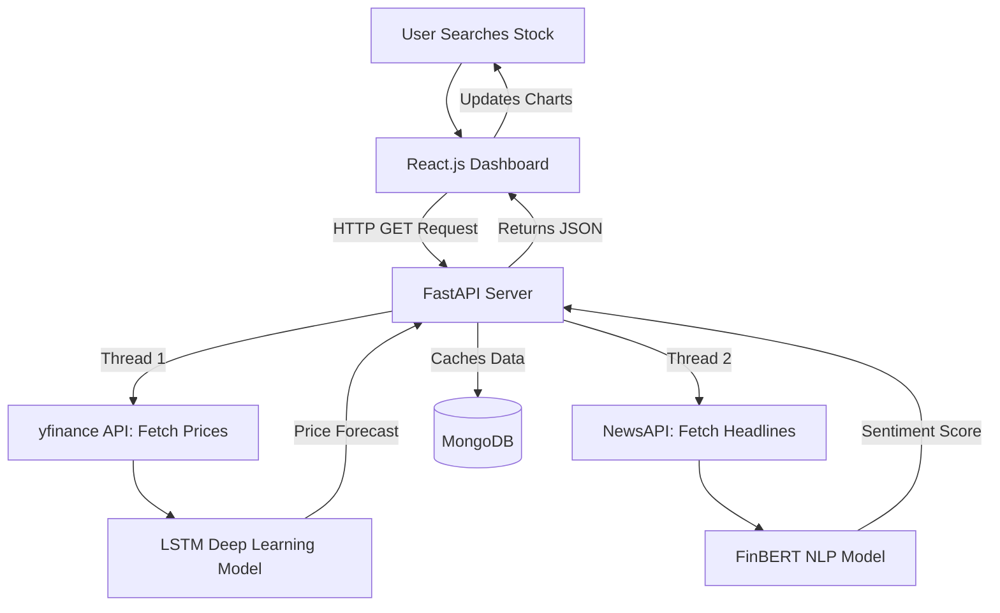

# 📈 AI-Driven Stock Market Sentiment & Prediction System

> **A unified financial dashboard that merges Quantitative Price Forecasting with Qualitative News Sentiment Analysis using Deep Learning and NLP.**

---

## 📖 About The Project

For retail investors and students, analyzing the stock market is overwhelming. You have to look at complex candlestick charts on one platform (Technical Analysis) and read hundreds of news articles on another (Fundamental/Sentiment Analysis). 

This project solves that problem by building a **"Hybrid AI Brain"**. 
It automatically fetches the historical data and real-time news, runs them through two separate AI models simultaneously, and presents a simplified **Prediction & Sentiment Score** on a clean and interactive dashboard.

### ✨ Key Features

* **🧠 Dual-AI Analysis:** * **The Quant Engine (LSTM):** A Long Short-Term Memory neural network that looks at the last 5 years of price history to predict the trend for the next 7 days.
  * **The Sentiment Engine (FinBERT):** A domain-specific NLP transformer model that reads today's financial headlines and scores the market mood (Positive, Negative, or Neutral).
* **⚡ Blazing Fast API:** Built with FastAPI, the backend processes heavy AI inference tasks asynchronously, delivering results in under 3 seconds.
* **📊 Interactive Dashboard:** A React.js frontend featuring beautiful Recharts (Candlestick and Line graphs) and a dynamic Sentiment Gauge.
* **🗄️ Smart Caching:** Uses MongoDB to cache recent searches, preventing API rate limits and instantly loading popular stock queries.

## 🧠 Architecture & Tech Stack
This project leverages a modern, decoupled architecture:
* **Data Ingestion:** `yfinance`, web scraping for financial news.
* **Time-Series Forecasting:** LSTM (Long Short-Term Memory) neural networks.
* **Sentiment Analysis:** FinBERT (pre-trained NLP model for the financial domain).
* **Backend / API:** FastAPI for serving predictions and reports.
* **Frontend:** React (for visualizing charts and AI summaries).

---

## 🏗️ System Architecture

GitHub natively renders the flowchart below. It shows exactly how data flows from the user to the AI models and back.

Prerequisites
-------------
- Python 3.9+ (3.10 recommended)
- Node.js 18+ and npm/yarn (for frontend)
- Optional: GPU (CUDA) for faster transformer/TensorFlow inference/training
- Git LFS if you plan to track the trained model file(s) in the repository

Recommended Python packages (also available as `requirements.txt`):
- fastapi
- uvicorn[standard]
- transformers
- torch (or torch-cpu)
- tensorflow (2.10+ recommended)
- yfinance
- requests
- numpy
- pandas
- scikit-learn
- joblib
- python-dotenv
- pymongo (if you enable caching/database)
- aiohttp (optional: async news fetches)

Quickstart — Backend
--------------------
1. Create a virtual environment and install dependencies:
   - python -m venv venv
   - source venv/bin/activate   (Windows: venv\Scripts\activate)
   - pip install -r requirements.txt

2. Create a `.env` file in AI Stock/backend/ (see `.env.example`) with:
   - NEWS_API_KEY=your_newsapi_key
   - HF_TOKEN=your_huggingface_token (optional)
   - MONGODB_URI=your_mongo_uri (optional)

3. (Optional) Train the LSTM model or place pretrained files:
   - python train_lstm.py
   - This will create `lstm_model.h5` and `scaler.gz` in the backend folder.

4. Run the backend:
   - uvicorn "main:app" --reload --host 0.0.0.0 --port 8000
  

Quickstart — Frontend
---------------------
1. Go to AI Stock/ai-stock-predictor/frontend
2. Install:
   - npm install
3. Set the backend URL in frontend environment file (e.g., `.env.local`):
   - VITE_API_BASE_URL=http://localhost:8000
4. Run dev server:
   - npm run dev
5. Build for production:
   - npm run build
   - npm run preview

Training the LSTM model (train_lstm.py)
--------------------------------------
- The script trains a 2-layer LSTM on historical AAPL close prices from 2014-01-01 to 2024-01-01.
- It saves:
  - `scaler.gz` — MinMaxScaler used for scaling close prices
  - `lstm_model.h5` — trained Keras model

## 💻 Next Goal
### Login Authentication Dashboard 
* When user enter , it requires authorised credentials from users
### Use of LLM 
*  It can read a financial report and write a paragraph explaining exactly why the market reacted the way it did.

