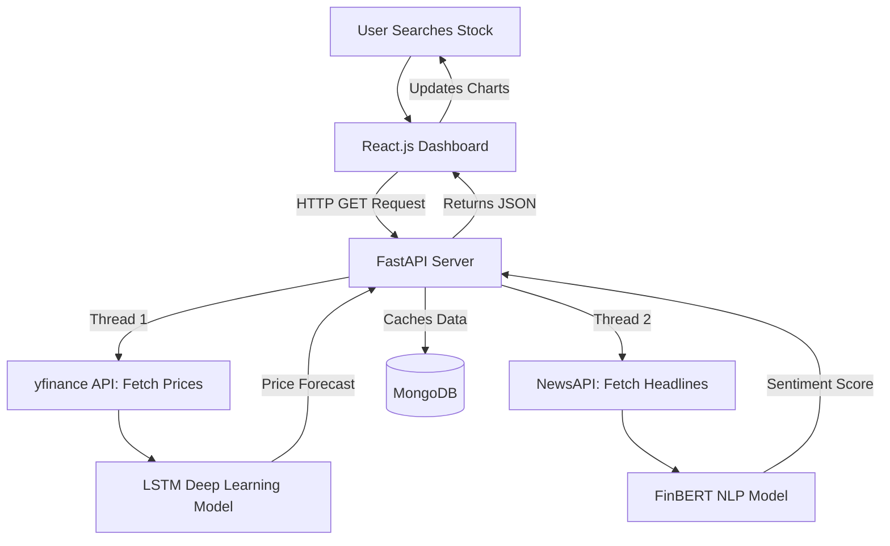
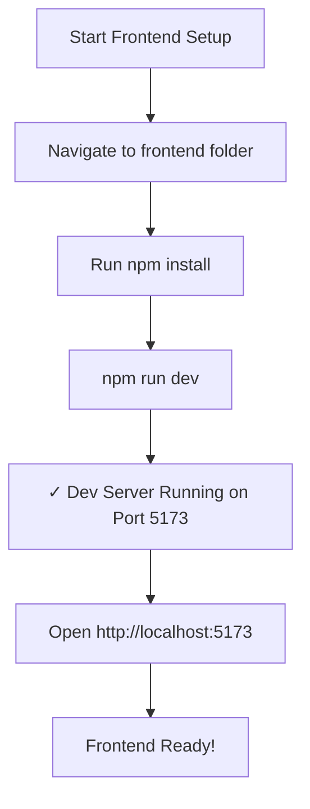
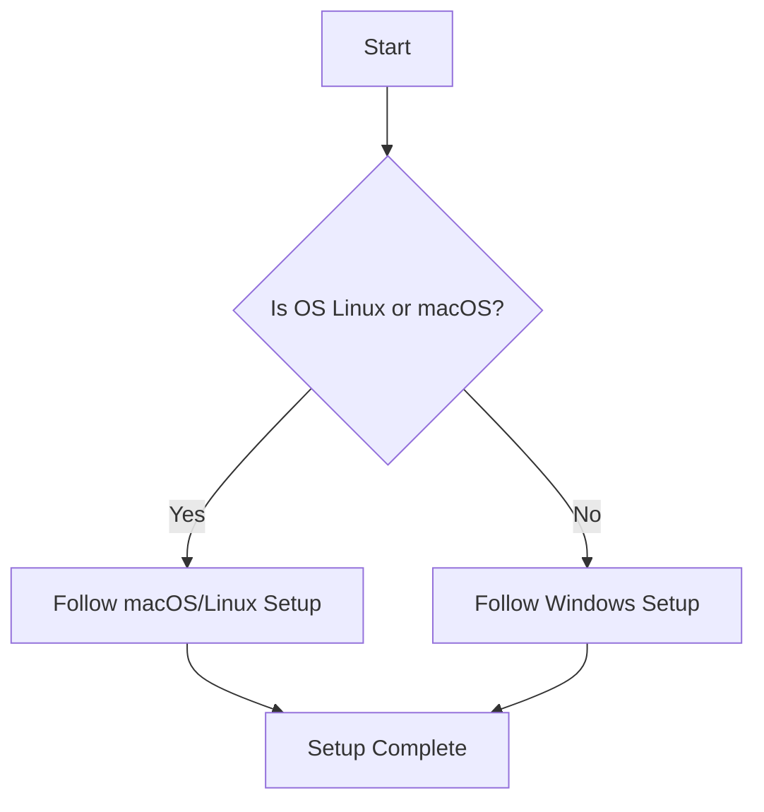

# 📈 AI-Driven Stock Market Sentiment & Prediction System


> **A unified financial dashboard that merges Quantitative Price Forecasting with Qualitative News Sentiment Analysis using Deep Learning and NLP.**

---

## 📖 About The Project

For retail investors and students, analyzing the stock market is overwhelming. You have to look at complex candlestick charts on one platform (Technical Analysis) and read hundreds of news articles on another platform (Fundamental/Sentiment Analysis). 

This project solves that problem by building a **"Hybrid AI Brain"**.
It automatically fetches the historical data and real-time news, runs them through two separate AI models simultaneously, and presents a simplified **Prediction & Sentiment Score** on a clean and interactive dashboard.

### ✨ Key Features
* **🧠 Dual-AI Analysis:** * **The Quant Engine (LSTM):** A Long Short-Term Memory neural network that looks at the last 5 years of price history to predict the trend for the next 7 days.
  * **The Sentiment Engine (FinBERT):** A domain-specific NLP transformer model that reads today's financial headlines and scores the market mood (Positive, Negative, or Neutral).
* **⚡ Blazing Fast API:** Built with FastAPI, the backend processes heavy AI inference tasks asynchronously, delivering results in under 3 seconds.
* **📊 Interactive Dashboard:** A React.js frontend featuring beautiful Recharts (Candlestick and Line graphs) and a dynamic Sentiment Gauge.
* **🗄️ Smart Caching:** Uses MongoDB to cache recent searches, preventing API rate limits and instantly loading popular stock queries.


## 🧠 Architecture & Tech Stack
This project leverages a modern, decoupled architecture:
* **Data Ingestion:** `yfinance`, web scraping for financial news.
* **Time-Series Forecasting:** LSTM (Long Short-Term Memory) neural networks.
* **Sentiment Analysis:** FinBERT (pre-trained NLP model for the financial domain).
* **Backend / API:** FastAPI for serving predictions and reports.
* **Frontend:** React (for visualizing charts and AI summaries).

---

## 🏗️ System Architecture

GitHub natively renders the flowchart below. It shows exactly how data flows from the user to the AI models and back.

### 📊 System Architecture & Data Flow

This flowchart illustrates the complete lifecycle of a single user request, demonstrating how our hybrid architecture processes concurrent API calls and Machine Learning tasks:

* **1. User Trigger:** The cycle begins when a user enters a stock ticker (e.g., `AAPL`) into the React.js dashboard.
* **2. Concurrent Data Ingestion:** The FastAPI orchestrator simultaneously fetches numerical historical data (via `yfinance`) and qualitative live news headlines (via `NewsAPI`).
* **3. Dual AI Processing:** * *Text Data* is routed to the **FinBERT** transformer model to calculate a market sentiment score.
  * *Numerical Data* is routed to the custom **LSTM** neural network to forecast the 61st-day price.
* **4. Unified Aggregation:** The backend combines the outputs from both AI models into a single, clean JSON payload.
* **5. UI Visualization:** The React frontend receives the JSON and dynamically updates the Recharts graphs and sentiment cards in real-time.


## 🏗️ Tech Stack

| Component | Technology |
| :--- | :--- |
| **Data Ingestion** | `yfinance`, web scraping for financial news |
| **Time-Series Forecasting** | LSTM (TensorFlow/Keras) |
| **Sentiment Analysis** | FinBERT (transformer-based NLP) |
| **Backend/API** | FastAPI + Uvicorn |
| **Frontend** | React 18.x + Vite |
| **Database** | MongoDB (caching) |
| **Language** | Python 3.9+, JavaScript/Node.js |

## 🔑 Environment Variables

To run this project securely, you will need to set up your environment variables. We use these to keep API keys and database passwords hidden from the public code.

Create a new file named `.env` inside the `backend` directory and add the following lines:
```env
# NewsAPI (Required for FinBERT Sentiment Analysis)
# Get a free key from: https://newsapi.org/
NEWS_API_KEY=your_api_key_here

# MongoDB (Optional: Only needed if you are using cloud caching)
MONGO_URI=your_mongodb_connection_string

Prerequisites
-------------
- Python 3.9+ (3.10 recommended)
- Node.js 18+ and npm/yarn (for frontend)
- Optional: GPU (CUDA) for faster transformer/TensorFlow inference/training
- Git LFS if you plan to track the trained model file(s) in the repository

Recommended Python packages (also available as `requirements.txt`):
- fastapi
- uvicorn[standard]
- transformers
- torch (or torch-cpu)
- tensorflow (2.10+ recommended)
- yfinance
- requests
- numpy
- pandas
- scikit-learn
- joblib
- python-dotenv
- pymongo (if you enable caching/database)
- aiohttp (optional: async news fetches)


Quickstart — Backend
--------------------
1. Create a virtual environment and install dependencies:
   - python -m venv venv
   - source venv/bin/activate   (Windows: venv\Scripts\activate)
   - pip install -r requirements.txt

2. Create a `.env` file in AI Stock/backend/ (see `.env.example`) with:
   - NEWS_API_KEY=your_newsapi_key
   - HF_TOKEN=your_huggingface_token (optional)
   - MONGODB_URI=your_mongo_uri (optional)

3. (Optional) Train the LSTM model or place pretrained files:
   - python train_lstm.py
   - This will create `lstm_model.h5` and `scaler.gz` in the backend folder.

4. Run the backend:
   - uvicorn "main:app" --reload --host 0.0.0.0 --port 8000

Quickstart — Frontend
---------------------
1. Go to AI Stock/ai-stock-predictor/frontend
2. Install:
   - npm install
   - npm install axios recharts lucide-react
3. Set the backend URL in frontend environment file (e.g., `.env.local`):
   - VITE_API_BASE_URL=http://localhost:8000
4. Run dev server:
   - npm run dev


Training the LSTM model (train_lstm.py)
--------------------------------------
- The script trains a 2-layer LSTM on historical AAPL close prices from 2014-01-01 to 2024-01-01.
- It saves:
  - `scaler.gz` — MinMaxScaler used for scaling close prices
  - `lstm_model.h5` — trained Keras model

## 💻 Next Goal
### Login Authentication Dashboard 
* When user enter , it requires authorised credentials from users
### Use of LLM 
*  It can read a financial report and write a paragraph explaining exactly why the market reacted the way it did.


## 🎨 Frontend Setup
```1. Go to AI Stock/ai-stock-predictor/frontend
   2. Install:
   - npm install
   - npm install axios recharts lucide-react
- npm run dev
```
### Frontend Status Badges


```
```
### Frontend Setup Flowchart


### Setup Flowchart


### OS-Specific Setup Comparison Table
| Feature               | macOS/Linux                        | Windows   
     |
|-----------------------|------------------------------------|-----------------------------------|
| Python Installation    | `brew install python`             | `choco install python`            |
| Virtualenv Setup      | `python3 -m venv venv`           | `python -m venv venv`           |
| Run Backend           | `python app.py`                   | `python app.py`                 |
### Step-by-Step Setup

<details>
<summary><strong>macOS/Linux</strong></summary>
1. Open terminal.
2. Install Python if not already installed.
3. Create a virtual environment:
 ```shell
   python3 -m venv venv
   ```
4. Activate the environment:
   ```shell
   source venv/bin/activate
   ```
5. Install required packages:
   ```shell
   pip install -r requirements.txt
   ```
6. Run the application:
   ```shell
   python app.py
   ```
</details>
<details>
<summary><strong>Windows</strong></summary>
1. Open Command Prompt.
2. Install Python if not already installed.
3. Create a virtual environment:
   ```shell
   python -m venv venv
   ```
4. Activate the environment:
   ```shell
   venv\Scripts\activate
   ```
5. Install required packages:
   ```shell
   pip install -r requirements.txt
   ```
   6. Run the application:
   ```shell
   python app.py
   ```
</details>

### Quick Links
- 🐍 [Python Installation Guide](https://www.python.org/downloads/)
- 📦 [Required Packages](https://example.com/packages)
- 🚀 [Run the App](#run)

### Environment Variables
- Set the following environment variables:
   - `DATABASE_URL`: your database connection string
   - `SECRET_KEY`: your application secret key.
 
## Backend Setup 
```bash
cd backend
pip install -r requirements.txt
uvicorn main:app --reload --port 8000
```
 
API will be live at `http://localhost:8000`.  
Interactive docs: `http://localhost:8000/docs`

## Integrated LLM — Google Gemini
```
What it is
The system uses Google Gemini (google-generativeai Python SDK) as its large language model to generate a human-readable, two-sentence executive summary of the current market sentiment for any requested ticker.
Why Gemini
FeatureDetailModelgemini-pro (or gemini-1.5-flash for faster responses)SDKgoogle-generativeai Python packageAuthAPI key via GEMINI_API_KEY environment variableInput5 live news headlines fetched from NewsAPI for the tickerOutputConcise 2-sentence analyst-style narrative
```
End-to-End Prediction Flow
```
GET /predict/AAPL
      │
      ├─ 1. yfinance → fetch 7-day price history (chart) + 60-day history (LSTM input)
      │
      ├─ 2. NewsAPI  → fetch 5 latest headlines for "AAPL stock"
      │
      ├─ 3. FinBERT  → score each headline → aggregate → Positive / Negative + confidence
      │
      ├─ 4. LSTM     → scale 60-day closes → predict next price → inverse-scale
      │
      ├─ 5. LLM      → craft prompt from headlines → generate 2-sentence analyst summary
      │
      └─ 6. Return unified JSON → React renders chart, sentiment badge, AI summary card

```


## 🚀 Deployment

This project follows a hybrid deployment architecture to efficiently handle frontend performance and heavy backend ML processing.

## 🌐 Live Application
	•	Frontend (Vercel): https://your-vercel-link.vercel.app
	•	Backend API: Exposed via ngrok (temporary public URL)

⸻

## 🧠 Deployment Architecture
	•	The frontend is deployed on Vercel for fast and scalable UI delivery.
	•	The backend, which includes heavy TensorFlow-based ML models, runs locally due to high computational requirements.
	•	ngrok is used to expose the local backend server to the internet.

⸻

### 🔄 How It Works
	1.	User interacts with the frontend hosted on Vercel
	2.	Frontend sends API requests to the ngrok public URL
	3.	ngrok tunnels the request to the local backend server
	4.	Backend processes ML logic and returns the response

### ⚠️ Important Notes
	•	ngrok URLs are temporary and change every time the tunnel restarts
	•	This setup is ideal for development and demonstration purposes
	•	For production, consider deploying backend on GPU-supported platforms like:
	•	AWS EC2 (with GPU)
	•	Google Cloud (Vertex AI / Compute Engine)
	•	Azure ML

⸻

## ☁️ Tech Stack
	•	Frontend: React.js (Vercel)
	•	Backend: FastAPI (Python)
	•	ML: TensorFlow
	•	Database & Auth: Firebase
	•	Tunneling: ngrok
	•	Version Control: GitHub


